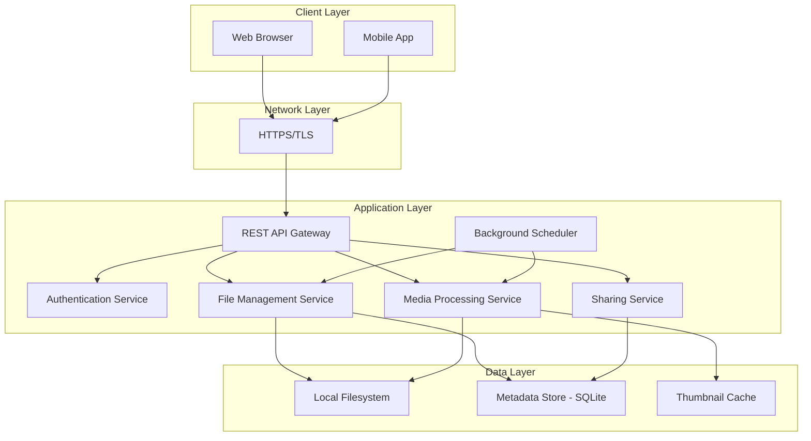
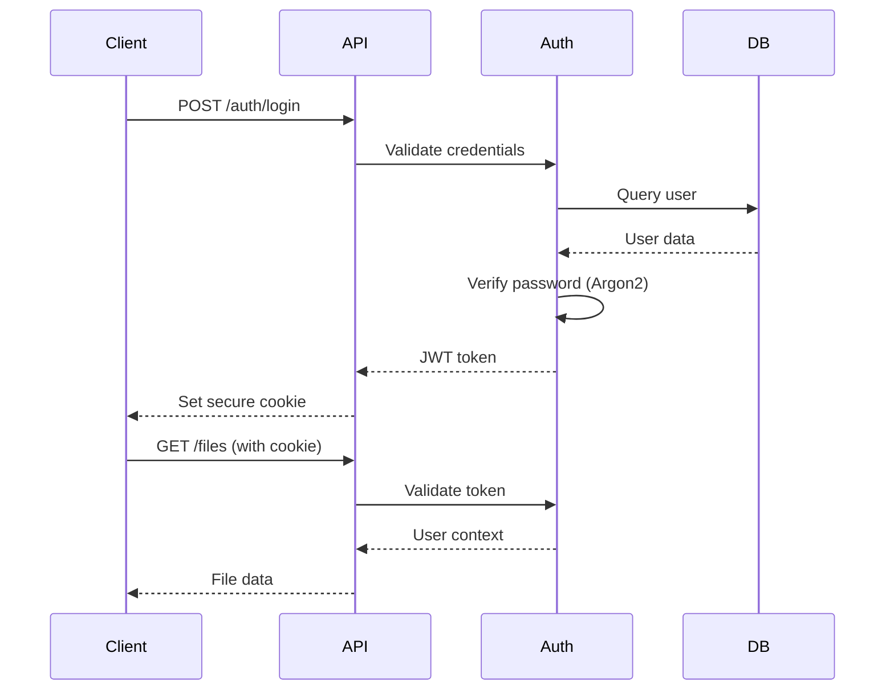
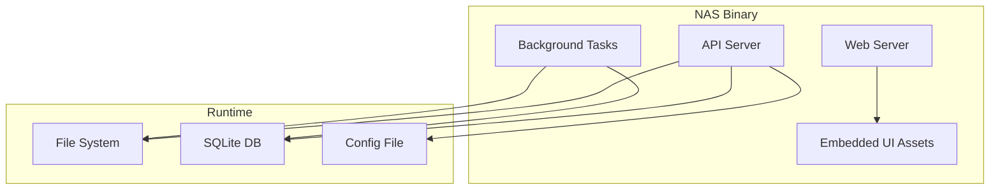

# SYSTEM PATTERNS - Simple Home NAS

## Architectural Vision

**Vision Statement**: Create a lightweight, self-hosted NAS server that combines enterprise-grade reliability with consumer-friendly simplicity, enabling secure file management and media consumption across devices.

## Architectural Principles

### 1. Simplicity First
- **Statement**: Prefer simple, well-understood solutions over complex ones
- **Rationale**: Reduces maintenance burden and improves reliability
- **Implications**: Single binary deployment, embedded database, minimal dependencies
- **Examples**: SQLite over PostgreSQL, single-process architecture

### 2. Security by Design
- **Statement**: Security controls are integrated into every layer
- **Rationale**: Personal data protection is paramount for home users
- **Implications**: HTTPS mandatory, secure authentication, input validation
- **Examples**: Argon2 password hashing, CSRF protection, rate limiting

### 3. Performance Within Constraints
- **Statement**: Optimize for performance within resource constraints
- **Rationale**: Must run efficiently on consumer hardware
- **Implications**: ≤2GB RAM usage, efficient file streaming, minimal CPU overhead
- **Examples**: Streaming I/O, background processing, memory-mapped files

### 4. Cross-Platform Compatibility
- **Statement**: Support major platforms without compromise
- **Rationale**: Users have diverse hardware environments
- **Implications**: Platform-agnostic code, consistent behavior
- **Examples**: macOS, Linux x86_64, ARM (Raspberry Pi)

## System Architecture

### High-Level Architecture



### Component Architecture

#### Backend Components (Rust)

1. **API Gateway**
   - **Responsibility**: Route requests, handle CORS, rate limiting
   - **Pattern**: Gateway pattern with middleware pipeline
   - **Technology**: Axum web framework

2. **Authentication Service**
   - **Responsibility**: User authentication, session management
   - **Pattern**: JWT with refresh tokens or signed cookies
   - **Security**: Argon2 password hashing, login rate limiting

3. **File Management Service**
   - **Responsibility**: File CRUD operations, directory browsing
   - **Pattern**: Repository pattern with streaming I/O
   - **Features**: Safe path handling, atomic operations, progress tracking

4. **Media Processing Service**
   - **Responsibility**: Thumbnail generation, video metadata extraction
   - **Pattern**: Producer-consumer with background processing
   - **Technology**: FFmpeg bindings or image processing libraries

5. **Sharing Service**
   - **Responsibility**: Public link generation and validation
   - **Pattern**: Token-based sharing with expiration
   - **Security**: Cryptographically secure tokens, access logging

6. **Background Scheduler**
   - **Responsibility**: Periodic tasks, file system scanning
   - **Pattern**: Cron-like scheduler with job queue
   - **Features**: Metadata updates, cleanup tasks, health checks

#### Frontend Components (React)

1. **Authentication Module**
   - Login/logout forms
   - Session management
   - Protected route handling

2. **File Explorer**
   - Tree sidebar navigation
   - File list/grid views
   - Drag-and-drop upload
   - Context menus

3. **Media Viewers**
   - Image lightbox with zoom
   - Video player with controls
   - Thumbnail grid view

4. **Transfer Manager**
   - Upload progress tracking
   - Download management
   - Pause/resume functionality

5. **Settings Dashboard**
   - Storage configuration
   - User preferences
   - System status

## Design Patterns

### 1. Repository Pattern
- **Usage**: File and metadata access
- **Benefits**: Testability, abstraction from storage details
- **Implementation**: Trait-based abstraction in Rust

### 2. Middleware Pipeline
- **Usage**: Request processing (auth, logging, rate limiting)
- **Benefits**: Composable, reusable cross-cutting concerns
- **Implementation**: Axum middleware or custom pipeline

### 3. Producer-Consumer
- **Usage**: Background media processing
- **Benefits**: Decouples processing from API responses
- **Implementation**: Tokio channels with worker tasks

### 4. Observer Pattern
- **Usage**: File system change notifications
- **Benefits**: Reactive updates to metadata
- **Implementation**: File system watchers with event broadcasting

## Technology Stack Decisions

### Backend Technology: Rust
- **Rationale**: Memory safety, performance, cross-platform support
- **Framework**: Axum
- **Database**: SQLite (embedded, zero-config, ACID)
- **Media Processing**: image crate, ffmpeg-next bindings
- **Authentication**: argon2, jsonwebtoken crates

### Frontend Technology: React
- **Rationale**: Rich ecosystem, component reusability, developer familiarity
- **Build Tool**: Vite (fast development, modern bundling)
- **UI Library**: Tailwind CSS
- **State Management**: Zustand
- **HTTP Client**: Axios

### Infrastructure
- **Deployment**: Single binary with embedded frontend
- **Configuration**: TOML or environment variables
- **Logging**: tracing crate with structured logging
- **Monitoring**: Health check endpoints, metrics collection

## Data Architecture

### File Metadata Schema
```sql
CREATE TABLE files (
    id INTEGER PRIMARY KEY,
    path TEXT UNIQUE NOT NULL,
    name TEXT NOT NULL,
    size INTEGER NOT NULL,
    modified_at DATETIME NOT NULL,
    mime_type TEXT,
    checksum TEXT,
    thumbnail_path TEXT,
    created_at DATETIME DEFAULT CURRENT_TIMESTAMP,
    updated_at DATETIME DEFAULT CURRENT_TIMESTAMP
);

CREATE TABLE shares (
    id TEXT PRIMARY KEY,
    file_id INTEGER REFERENCES files(id),
    hash_id TEXT UNIQUE NOT NULL,
    expires_at DATETIME,
    access_count INTEGER DEFAULT 0,
    max_access INTEGER,
    created_at DATETIME DEFAULT CURRENT_TIMESTAMP
);

CREATE TABLE users (
    id INTEGER PRIMARY KEY,
    username TEXT UNIQUE NOT NULL,
    password_hash TEXT NOT NULL,
    last_login DATETIME,
    created_at DATETIME DEFAULT CURRENT_TIMESTAMP
);

CREATE TABLE user_sessions (
    id TEXT PRIMARY KEY,
    user_id INTEGER REFERENCES users(id),
    session_id TEXT UNIQUE NOT NULL,
    expires_at DATETIME NOT NULL,
    created_at DATETIME DEFAULT CURRENT_TIMESTAMP
);
```

### File Storage Structure
```
/configured/root/path/
├── user_files/           # User-uploaded files
├── .nas_metadata/        # System metadata
│   ├── database.sqlite   # Metadata database
│   ├── thumbnails/       # Generated thumbnails
│   └── logs/            # Application logs
└── .nas_config/         # Configuration files
    └── config.toml      # System configuration
```

## API Architecture (CREATIVE PHASE COMPLETED)

### REST API Endpoints
```
// File Operations
GET    /api/v1/files/browse?path={path}&limit={limit}&offset={offset}
POST   /api/v1/files/upload                    // Multipart form data
GET    /api/v1/files/{fileId}/download         // With Range header support
GET    /api/v1/files/{fileId}/metadata
PATCH  /api/v1/files/{fileId}                  // Rename, move operations
DELETE /api/v1/files/{fileId}
GET    /api/v1/files/{fileId}/thumbnail        // Generated thumbnails

// Sharing Operations  
POST   /api/v1/shares                          // Create share link
GET    /api/v1/shares/{hashId}                 // Access shared file
DELETE /api/v1/shares/{hashId}                 // Revoke share link
GET    /api/v1/shares                          // List user's shares

// Authentication
POST   /api/v1/auth/login
POST   /api/v1/auth/refresh  
DELETE /api/v1/auth/logout
GET    /api/v1/auth/profile

// System Operations
GET    /api/v1/system/status                   // Storage usage, health
GET    /api/v1/system/health                   // Health check endpoint
```

### JWT Authentication Implementation
```rust
#[derive(Serialize, Deserialize)]
pub struct Claims {
    pub sub: String,          // User ID
    pub exp: usize,           // Expiration timestamp
    pub iat: usize,           // Issued at timestamp
    pub role: String,         // User role (admin, user)
    pub session_id: String,   // Session identifier for revocation
}
```

### Secure Share Link Generation
```rust
impl ShareService {
    fn generate_secure_hash(&self, file_id: &str) -> String {
        use sha2::{Sha256, Digest};
        use rand::Rng;
        
        let mut rng = rand::thread_rng();
        let salt: [u8; 16] = rng.gen();
        let timestamp = Utc::now().timestamp_nanos();
        
        let mut hasher = Sha256::new();
        hasher.update(file_id.as_bytes());
        hasher.update(&salt);
        hasher.update(&timestamp.to_be_bytes());
        
        // Take first 12 bytes and encode as URL-safe base64
        let hash = hasher.finalize();
        base64::encode_config(&hash[..12], base64::URL_SAFE_NO_PAD)
    }
}
```

### File Streaming with Range Support
- HTTP Range request support for partial content delivery
- Memory-efficient streaming for large files (>1GB)
- Progress tracking via WebSocket connections
- Atomic file operations with cleanup on failure

### Rate Limiting Strategy
- Authentication endpoints: 5 requests per minute per IP
- Upload endpoints: 10 requests per minute per user
- Download endpoints: 100 requests per minute per user
- General API: 1000 requests per hour per user

## Security Architecture

### Authentication Flow


### Security Controls
1. **Transport Security**: TLS 1.3, HSTS headers
2. **Authentication**: Argon2 password hashing, secure session management
3. **Authorization**: Role-based access control (admin role for MVP)
4. **Input Validation**: Path traversal prevention, file type validation
5. **Rate Limiting**: Login attempts, API requests
6. **CSRF Protection**: SameSite cookies, CSRF tokens for state-changing operations

## Performance Architecture

### File Transfer Optimization
- **Streaming I/O**: No full file buffering in memory
- **Range Requests**: Support for partial content delivery
- **Compression**: Gzip for text files, metadata responses
- **Caching**: Browser caching headers, thumbnail caching

### Database Optimization
- **Indexing**: Path-based queries, filename searches
- **Connection Pooling**: SQLite connection management
- **Write-Ahead Logging**: Concurrent read/write performance

### Memory Management
- **Bounded Buffers**: Limit memory usage during transfers
- **Lazy Loading**: Load file metadata on demand
- **Resource Cleanup**: Proper cleanup of file handles, connections

## Deployment Architecture

### Single Binary Deployment


### Cross-Platform Considerations
- **Path Handling**: Platform-agnostic path operations
- **File Permissions**: Respect OS permission models
- **Service Integration**: Systemd (Linux), launchd (macOS) support
- **Resource Limits**: Configurable memory/CPU limits

## Implementation Phases

### Phase 0: Foundation
- Project structure, CI/CD pipeline
- Basic Rust/React setup
- Development tooling

### Phase 1: Core MVP
- Basic authentication
- File browsing and CRUD
- Simple web UI
- Storage status display

### Phase 2: Security & Quality
- HTTPS implementation
- Enhanced security controls
- File transfer improvements
- Background file scanner

### Phase 3: Sharing & Search
- Public link sharing
- File search functionality
- Enhanced UI features

### Phase 4: Media Services
- Image thumbnail generation
- Video playback support
- Media-specific UI components

### Phase 5: Production Readiness
- Cross-platform builds
- Docker containerization
- Comprehensive documentation
- Performance testing

### Phase 6: Advanced Features
- Multi-user support
- Upload resume capability
- Video transcoding
- Cloud backup integration

## Risk Assessment

### Technical Risks
1. **File System Performance**: Large directories, concurrent access
   - **Mitigation**: Pagination, background indexing, file locking
2. **Memory Usage**: Large file transfers, thumbnail generation
   - **Mitigation**: Streaming, bounded buffers, lazy loading
3. **Cross-Platform Compatibility**: Path handling, permissions
   - **Mitigation**: Extensive testing, platform-specific code paths

### Security Risks
1. **Path Traversal Attacks**: Malicious file paths
   - **Mitigation**: Path canonicalization, whitelist validation
2. **Resource Exhaustion**: Large uploads, concurrent requests
   - **Mitigation**: Rate limiting, resource quotas, timeouts
3. **Data Exposure**: Unauthorized file access
   - **Mitigation**: Authentication, authorization, audit logging

### Operational Risks
1. **Data Loss**: File system corruption, accidental deletion
   - **Mitigation**: Atomic operations, backup recommendations
2. **Performance Degradation**: Large file collections
   - **Mitigation**: Indexing, caching, background processing
3. **Configuration Complexity**: User setup difficulties
   - **Mitigation**: Sensible defaults, configuration validation

## Quality Attributes

### Performance Targets
- **File Transfer**: ≥100 MB/s on Gigabit LAN
- **API Latency**: <200ms for metadata operations
- **Memory Usage**: ≤2GB RAM under normal load
- **Startup Time**: <5 seconds from launch to ready

### Reliability Targets
- **Uptime**: 99.9% availability during normal operation
- **Data Integrity**: Zero data loss under normal shutdown
- **Error Recovery**: Graceful handling of network/storage errors

### Usability Targets
- **Setup Time**: <15 minutes from download to first use
- **Response Time**: <1 second for UI interactions
- **Learning Curve**: Intuitive for non-technical users

## Architecture Decision Records (ADRs)

### ADR-001: API Design & Data Flow ✅ COMPLETED
- **Status**: Accepted
- **Context**: Need RESTful API with efficient file operations and secure sharing
- **Decision**: Hierarchical REST API with JWT authentication and hashed share links
- **Consequences**: 
  - Standard REST conventions for tool compatibility
  - JWT provides stateless authentication for scaling
  - Cryptographically secure share links prevent enumeration attacks
  - HTTP Range support enables efficient media streaming
  - Comprehensive error handling improves user experience

### ADR-002: Authentication Strategy (JWT vs Sessions)
- **Status**: Accepted
- **Context**: Need secure, stateless authentication
- **Decision**: JWT with refresh tokens and session tracking
- **Consequences**: 
  - Stateless design enables horizontal scaling
  - Session tracking in SQLite allows token revocation
  - Refresh tokens provide balance of security and usability

### ADR-003: Database Schema Design
- **Status**: Accepted
- **Context**: Need efficient metadata storage and querying
- **Decision**: SQLite with optimized schema for file operations
- **Consequences**: 
  - Embedded database reduces deployment complexity
  - Indexed queries provide fast file system navigation
  - Session tracking enables secure authentication

## Creative Phase Requirements

Components requiring detailed creative design before implementation:

### 1. ~~Media Processing Architecture~~ → **COMPLETED: Security Model Implementation** ✅
**Priority**: ~~Medium~~ → **COMPLETED: Critical**  
**Creative Type**: ~~Algorithm + Architecture Design~~ → **Architecture Design**  
**Scope**: ~~Thumbnail generation, video processing, background task management~~ → **Authentication, Authorization, Input Validation, Rate Limiting, Security Headers, Audit Logging**  
**Duration**: ~~2-3 days~~ → **COMPLETED**  
**Status**: ✅ **COMPLETED** - Comprehensive security architecture documented

### 2. **API Design & Data Flow** ✅ COMPLETED
**Priority**: High  
**Creative Type**: Architecture Design  
**Scope**: RESTful API structure, authentication flow, data models  
**Duration**: 2 days  
**Status**: ✅ **COMPLETED** - Hierarchical REST API with JWT authentication

### 3. **User Interface Architecture** 🎨 NEXT
**Priority**: High  
**Creative Type**: UI/UX Design  
**Scope**: Component hierarchy, routing, state management, responsive design  
**Duration**: 3-4 days  
**Status**: Ready for creative phase

### 4. **Media Processing Architecture** 🎨 PENDING  
**Priority**: Medium  
**Creative Type**: Algorithm + Architecture Design  
**Scope**: Thumbnail generation, video processing, background task management  
**Duration**: 2-3 days  
**Status**: Pending (can start after Security Model)

### 5. **Performance Optimization Strategy** 🎨 PENDING
**Priority**: High  
**Creative Type**: Algorithm Design  
**Scope**: File streaming, caching, memory management, database optimization  
**Duration**: 2 days  
**Status**: Pending (requires UI and Media components)

## CREATIVE PHASE DOCUMENTATION

### Security Model Implementation ✅ COMPLETED

**🎨🎨🎨 ENTERING CREATIVE PHASE: Security Model Implementation**

#### Component Description
Comprehensive security architecture for the Simple Home NAS system, encompassing authentication flows, authorization mechanisms, input validation strategies, rate limiting, security headers, and threat mitigation while maintaining usability for home users.

#### Requirements & Constraints
**Functional Requirements**:
- Multi-layer Authentication: JWT tokens with refresh mechanism and session tracking
- Authorization System: Role-based access control with file-level permissions
- Input Validation: Comprehensive validation for all user inputs and file operations
- Rate Limiting: Tiered rate limiting for different operation types
- Security Headers: HTTPS enforcement, CSRF protection, security headers
- Audit Logging: Security event logging and monitoring

**Technical Constraints**:
- Performance: Security checks <50ms overhead
- Memory: Fit within 2GB total system memory limit
- Compatibility: Cross-platform implementation (macOS, Linux, ARM)
- Dependencies: Build on completed API Design & Data Flow architecture
- Standards: Follow OWASP security guidelines and industry best practices

#### Options Analysis
**Option 1**: Layered Defense with Middleware Pipeline
- ✅ Clear separation of concerns, early termination, testability
- ❌ Performance overhead, context loss, coordination complexity

**Option 2**: Security Service with Context Injection  
- ✅ Centralized logic, rich context, performance optimization
- ❌ Single point of failure, monolithic design, limited flexibility

**Option 3**: Event-Driven Security with Observer Pattern
- ✅ Real-time response, extensible, natural audit trail
- ❌ Complex event management, latency, debugging difficulty

**Option 4**: Zero-Trust Security Model
- ✅ Maximum security, granular control, compliance ready
- ❌ Performance impact, implementation complexity, over-engineering

#### Recommended Approach ✅
**Selected**: **Option 2 (Security Service) with Option 1 (Middleware) integration**

**Justification**:
1. **Best Balance**: Combines centralized security logic with middleware performance
2. **Context-Aware**: Rich security context enables intelligent decisions  
3. **Performance**: Single security service call with middleware pre-filtering
4. **Maintainability**: Clear security service boundary with testable components
5. **Home NAS Appropriate**: Right security level without over-engineering

#### Implementation Guidelines ✅

**1. Hybrid Architecture Design**:
```rust
// Hybrid approach: Lightweight middleware + Security Service
pub struct SecurityMiddleware {
    security_service: Arc<SecurityService>,
}

pub struct SecurityService {
    auth: AuthService,
    authz: AuthorizationService, 
    validator: InputValidator,
    audit: AuditLogger,
    rate_limiter: RateLimiter,
}
```

**2. Authentication Layer**:
- JWT validation with session verification
- Secure login with rate limiting
- Session management and token lifecycle
- Argon2 password hashing

**3. Authorization Framework**:
- Permission-based access control
- Path-based file access validation
- Share-based permission inheritance
- Role-based system operations

**4. Input Validation Strategy**:
- Path traversal prevention
- Filename sanitization
- File type validation
- Size limit enforcement

**5. Rate Limiting Implementation**:
- Tiered rate limits by operation type
- Per-IP and per-user tracking
- Exponential backoff for violations
- Redis-based distributed storage

**6. Security Headers and HTTPS**:
- Strict Transport Security
- Content Security Policy
- XSS and CSRF protection
- Frame options and content type validation

**7. Audit Logging Framework**:
- Security event classification
- Risk-based alerting
- Structured logging for analysis
- Retention and compliance support

#### Verification Checkpoint ✅

**Requirements Verification**:
- ✅ Multi-layer Authentication: JWT + session tracking implemented
- ✅ Authorization System: Role-based + path-based permissions
- ✅ Input Validation: Comprehensive validation for paths, files, auth
- ✅ Rate Limiting: Tiered rate limiting by operation type
- ✅ Security Headers: HTTPS enforcement and security headers
- ✅ Audit Logging: Security event logging with risk assessment

**Technical Constraints Verification**:
- ✅ Performance: <50ms security overhead (middleware + service call)
- ✅ Memory: Efficient in-memory stores with TTL cleanup
- ✅ Compatibility: Cross-platform security implementation
- ✅ Dependencies: Builds on JWT auth from API Design phase
- ✅ Standards: Follows OWASP guidelines and best practices

**Design Quality Verification**:
- ✅ Security Depth: Defense in depth with multiple security layers
- ✅ Maintainability: Clear service boundaries and responsibilities
- ✅ Testability: Security components independently testable
- ✅ Performance: Optimized security checks with minimal overhead
- ✅ Extensibility: Easy to add new security rules and handlers

**🎨🎨🎨 EXITING CREATIVE PHASE: Security Model Implementation**

**Status**: ✅ **COMPLETED** - Ready for Implementation
**Implementation Ready**: Authentication service, authorization framework, input validation, rate limiting, security headers, and audit logging.

**COMPLETED**: ✅ API Design & Data Flow 