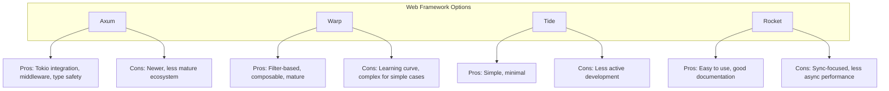

# TECHNICAL CONTEXT - Simple Home NAS

## Technology Stack Overview

### Core Technologies
- **Backend**: Rust (latest stable)
- **Frontend**: React 18+ with TypeScript
- **Database**: SQLite 3.x (embedded)
- **Build System**: Cargo (Rust) + Vite (React)
- **Deployment**: Single binary with embedded assets

## Technical Constraints

### Resource Constraints
- **Memory**: ≤2 GB RAM under normal operation
- **CPU**: Must run efficiently on single CPU core
- **Storage**: Local filesystem only, no external object storage
- **Network**: Optimized for home network speeds (100 Mbps - 1 Gbps)

### Platform Requirements
- **Primary Targets**: 
  - macOS (Intel & Apple Silicon)
  - Linux x86_64 (Ubuntu, Debian, CentOS, Arch)
  - Linux ARM64 (Raspberry Pi 4+)
- **Minimum System Requirements**:
  - 1 GB RAM available
  - 100 MB disk space for application
  - Network interface for LAN access

### Compatibility Constraints
- **Database**: No external database dependencies
- **Dependencies**: Minimize system dependencies
- **Licensing**: Open-source licenses only (MIT, Apache 2.0, BSD)
- **Standards**: Follow web standards for maximum browser compatibility

## Backend Technology Context

### Rust Ecosystem Choices

#### Web Framework Analysis


**Framework Decision Criteria**:
- Async/await support for file I/O
- Middleware support for auth, logging, CORS
- WebSocket support for real-time updates
- Static file serving capability
- Community support and maintenance

#### Database Layer
```rust
// Repository pattern with SQLite
pub trait FileRepository {
    async fn get_file_by_path(&self, path: &str) -> Result<Option<FileMetadata>>;
    async fn list_directory(&self, path: &str) -> Result<Vec<FileMetadata>>;
    async fn create_file_entry(&self, file: &FileMetadata) -> Result<()>;
    async fn update_file_entry(&self, file: &FileMetadata) -> Result<()>;
    async fn delete_file_entry(&self, path: &str) -> Result<()>;
}

pub struct SqliteFileRepository {
    pool: SqlitePool,
}
```

#### Key Rust Crates
- **Web Framework**: `axum` or `warp`
- **Async Runtime**: `tokio` with full features
- **Database**: `sqlx` with SQLite driver
- **Serialization**: `serde` with JSON support
- **Authentication**: `argon2`, `jsonwebtoken`
- **File I/O**: `tokio-fs`, `async-std`
- **Media Processing**: `image`, `ffmpeg-next`
- **Configuration**: `config`, `serde`
- **Logging**: `tracing`, `tracing-subscriber`
- **Error Handling**: `anyhow`, `thiserror`

### Performance Considerations

#### Memory Management
```rust
// Streaming file transfers to avoid memory bloat
pub async fn stream_file(
    path: PathBuf,
    range: Option<Range<u64>>,
) -> Result<impl Stream<Item = Result<Bytes>>> {
    let file = tokio::fs::File::open(path).await?;
    let reader = tokio::io::BufReader::new(file);
    
    // Stream in chunks to limit memory usage
    const CHUNK_SIZE: usize = 64 * 1024; // 64KB chunks
    
    ReaderStream::with_capacity(reader, CHUNK_SIZE)
}
```

#### Concurrent Access
- **File Locking**: Advisory locking for write operations
- **Connection Pooling**: SQLite connection pool management
- **Background Tasks**: Separate task pool for media processing
- **Rate Limiting**: Token bucket algorithm for API requests

## Frontend Technology Context

### React Ecosystem Choices

#### Build Tool: Vite
- **Rationale**: Fast development server, modern bundling, TypeScript support
- **Configuration**: Optimized for single-page application
- **Asset Handling**: Embedded into Rust binary via `include_dir!`

#### State Management Strategy
```typescript
// Context + Reducer pattern for complex state
interface AppState {
  user: User | null;
  currentPath: string;
  files: FileEntry[];
  uploads: UploadProgress[];
  settings: UserSettings;
}

// Or Zustand for simpler state management
interface FileStore {
  files: FileEntry[];
  currentPath: string;
  setFiles: (files: FileEntry[]) => void;
  navigateTo: (path: string) => void;
  uploadFiles: (files: File[]) => Promise<void>;
}
```

#### UI Component Strategy
- **Design System**: Custom components or Tailwind CSS
- **Accessibility**: WCAG 2.1 AA compliance
- **Responsive Design**: Mobile-first approach
- **Dark/Light Theme**: CSS custom properties

#### Key React Libraries
- **Router**: `react-router-dom` v6
- **HTTP Client**: `axios` or native `fetch`
- **State Management**: `zustand` or Context API
- **UI Components**: `@headlessui/react` + Tailwind CSS
- **File Upload**: `react-dropzone`
- **Media Player**: `react-player` or custom HTML5
- **Icons**: `lucide-react` or `heroicons`
- **Forms**: `react-hook-form` with validation

## Data Storage Architecture

### SQLite Configuration
```sql
-- Optimized SQLite settings for NAS usage
PRAGMA journal_mode = WAL;           -- Write-Ahead Logging for concurrency
PRAGMA synchronous = NORMAL;         -- Balance safety vs performance
PRAGMA cache_size = -64000;          -- 64MB cache size
PRAGMA foreign_keys = ON;            -- Enforce referential integrity
PRAGMA temp_store = MEMORY;          -- Use memory for temporary tables
```

### File System Strategy
```rust
// Safe path handling to prevent directory traversal
pub fn sanitize_path(user_path: &str, root: &Path) -> Result<PathBuf> {
    let path = Path::new(user_path);
    let canonical = root.join(path).canonicalize()?;
    
    // Ensure path is within root directory
    if !canonical.starts_with(root) {
        return Err(SecurityError::PathTraversal);
    }
    
    Ok(canonical)
}
```

### Thumbnail Generation
```rust
// Efficient thumbnail generation with caching
pub async fn generate_thumbnail(
    source_path: &Path,
    thumbnail_path: &Path,
    max_size: u32,
) -> Result<()> {
    let img = image::open(source_path)?;
    let thumbnail = img.thumbnail(max_size, max_size);
    
    // Save with optimized settings
    thumbnail.save_with_format(thumbnail_path, image::ImageFormat::WebP)?;
    Ok(())
}
```

## Security Architecture

### Authentication Implementation
```rust
// JWT token structure
#[derive(Serialize, Deserialize)]
pub struct Claims {
    pub sub: String,    // User ID
    pub exp: usize,     // Expiration time
    pub iat: usize,     // Issued at
    pub role: String,   // User role
}

// Argon2 password hashing
pub fn hash_password(password: &str) -> Result<String> {
    let salt = SaltString::generate(&mut OsRng);
    let argon2 = Argon2::default();
    let password_hash = argon2.hash_password(password.as_bytes(), &salt)?;
    Ok(password_hash.to_string())
}
```

### HTTPS Configuration
```rust
// TLS configuration for production
pub fn create_tls_config() -> Result<TlsConfig> {
    let cert = load_certs("cert.pem")?;
    let key = load_private_key("key.pem")?;
    
    TlsConfig::builder()
        .with_single_cert(cert, key)?
        .with_protocol_versions(&[&rustls::version::TLS13])
        .build()
}
```

## Development Environment

### Development Tools
- **Rust**: rustc 1.70+, cargo, clippy, rustfmt
- **Node.js**: v18+ for React development
- **Database**: SQLite CLI for schema management
- **Testing**: cargo test, jest for React components
- **Linting**: ESLint, Prettier for TypeScript/React

### Build Pipeline
```toml
# Cargo.toml build configuration
[profile.release]
opt-level = 3
lto = true
codegen-units = 1
panic = "abort"

[features]
default = ["embed-ui"]
embed-ui = []  # Embed React build into binary
dev-server = [] # Separate dev server for development
```

### Cross-Compilation Setup
```bash
# Target platforms
rustup target add x86_64-unknown-linux-gnu
rustup target add aarch64-unknown-linux-gnu
rustup target add x86_64-apple-darwin
rustup target add aarch64-apple-darwin

# Cross-compilation dependencies
cargo install cross
```

## Performance Optimization

### Backend Optimizations
- **Connection Pooling**: Limit SQLite connections
- **Async I/O**: Non-blocking file operations
- **Memory Mapping**: For large file metadata operations
- **Compression**: Gzip for API responses
- **Caching**: In-memory cache for frequently accessed data

### Frontend Optimizations
- **Code Splitting**: Route-based lazy loading
- **Asset Optimization**: Image compression, minification
- **Virtual Scrolling**: For large file lists
- **Debouncing**: Search input, API calls
- **Service Worker**: For offline functionality

## Deployment Strategy

### Single Binary Deployment
```rust
// Embed React build into Rust binary
use include_dir::{include_dir, Dir};

static UI_ASSETS: Dir = include_dir!("$CARGO_MANIFEST_DIR/ui/dist");

pub fn serve_ui_assets() -> Router {
    Router::new()
        .nest_service("/", ServeDir::new(&UI_ASSETS))
        .fallback(serve_index_html)
}
```

### Configuration Management
```toml
# config.toml
[server]
host = "0.0.0.0"
port = 8080
tls_cert_path = ""
tls_key_path = ""

[storage]
root_path = "./storage"
max_file_size = "10GB"
allowed_extensions = ["jpg", "png", "mp4", "pdf"]

[auth]
jwt_secret = "generate-secure-secret"
session_timeout = "24h"
```

## Integration Points

### External Dependencies
- **FFmpeg**: Optional for video processing (system dependency)
- **ImageMagick**: Alternative to Rust image crate for complex operations
- **System Services**: Integration with systemd/launchd for auto-start

### API Design Principles
- **RESTful**: Standard HTTP methods and status codes
- **Versioning**: API version in URL path (/api/v1/)
- **Error Handling**: Consistent error response format
- **Rate Limiting**: Per-IP and per-user rate limits
- **CORS**: Configurable cross-origin resource sharing

## Quality Assurance

### Testing Strategy
- **Unit Tests**: Rust modules, React components
- **Integration Tests**: API endpoints, database operations
- **End-to-End Tests**: Complete user workflows
- **Performance Tests**: File transfer speeds, concurrent users
- **Security Tests**: Authentication, authorization, input validation

### Monitoring and Logging
```rust
// Structured logging with tracing
#[instrument(skip(file_data))]
pub async fn upload_file(
    path: String,
    file_data: Bytes,
) -> Result<FileMetadata> {
    info!("Starting file upload: {}", path);
    
    // Upload logic...
    
    info!("File upload completed: {} bytes", file_data.len());
    Ok(metadata)
}
```

## Risk Mitigation

### Technical Risks
1. **Memory Leaks**: Regular profiling, automated testing
2. **File Corruption**: Atomic operations, checksums
3. **Performance Degradation**: Benchmarking, optimization
4. **Security Vulnerabilities**: Regular audits, dependency updates

### Operational Risks
1. **Dependency Updates**: Automated security scanning
2. **Platform Compatibility**: Continuous integration testing
3. **User Data Loss**: Backup recommendations, data validation
4. **Configuration Errors**: Validation, sensible defaults

This technical context provides the foundation for implementing a robust, secure, and performant home NAS solution that meets all specified requirements while maintaining simplicity and reliability. 